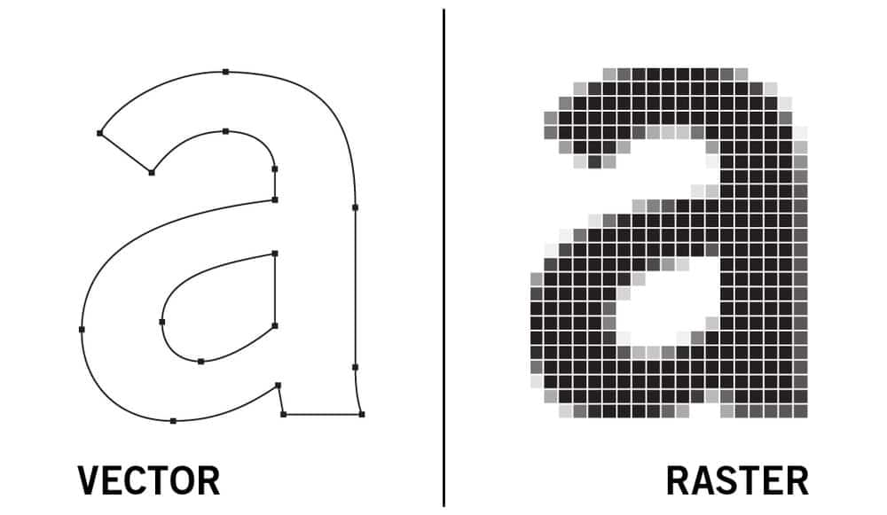
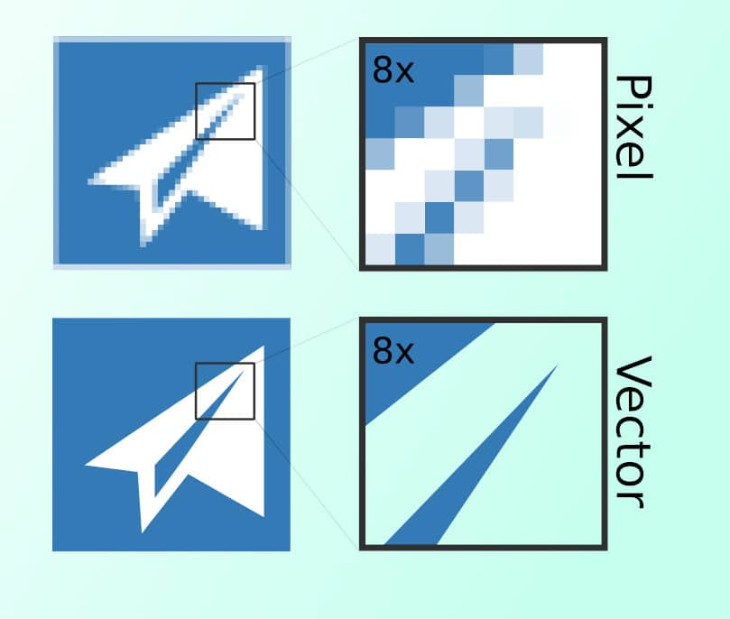
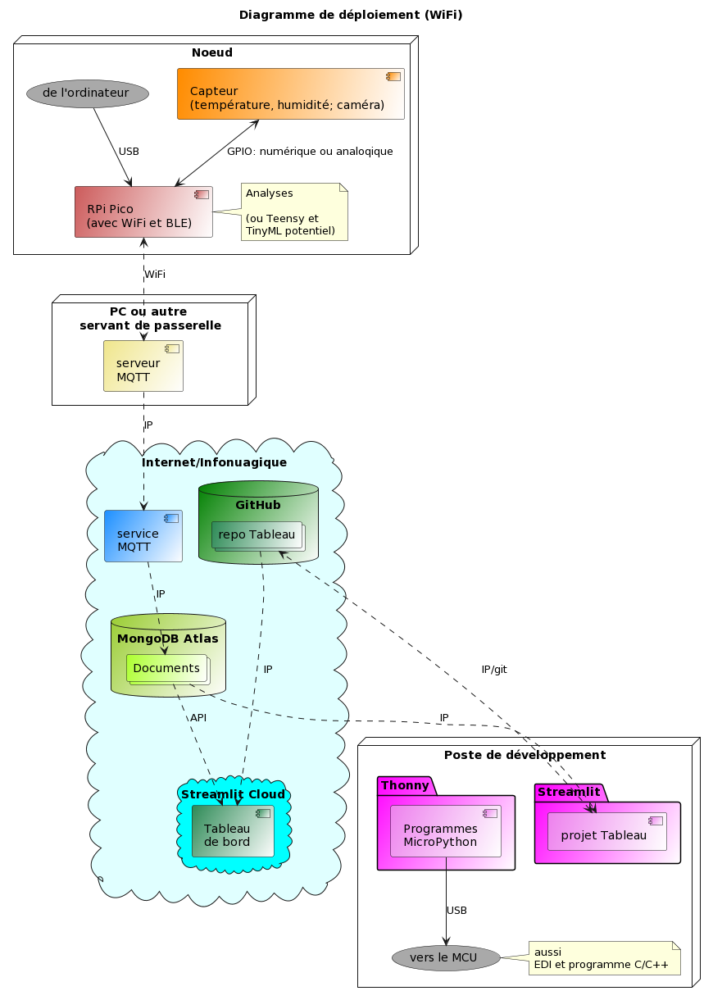
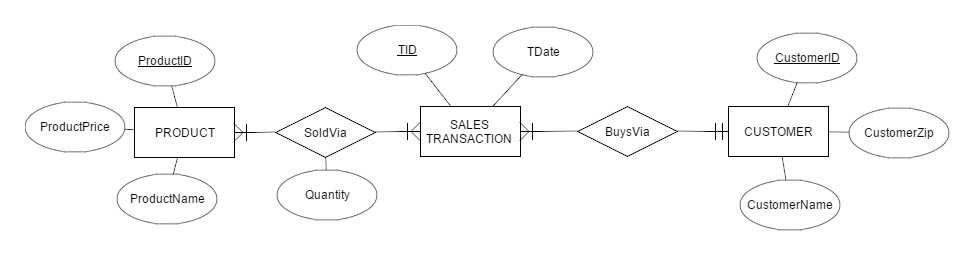
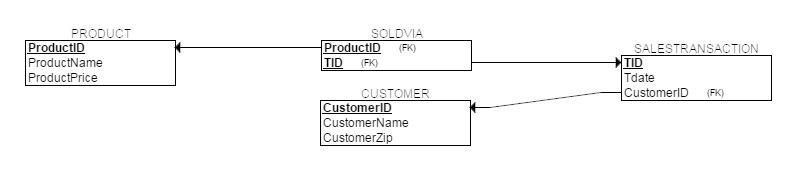
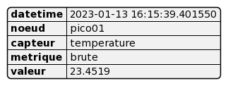

# LaTeX; dessins vectoriels

Un complément aux dépôts : **documentations_web_statiques** et **latex_pocket_book**.

## Éditeurs LaTeX

Pour les images, le PDF est le format du LaTeX. Les formats PNG, JPG et JPEG passent aussi. Par contre, le SVG doit être converti en PDF.

Il est possible de dessiner en LaTeX grâce au module TikZ/PGF :

- Documentation en ligne et en PDF téléchargeable, galerie d'exemples.
- Beaucoup de références, de démos, de contenu pour apprendre.
- Dans un éditeur LaTeX en local ou en ligne.
- Nombreuses extensions spécialisées en diagrammes et schémas pour les mathématiques, la physique, l'informatique, la chimie, l'électricité, les réseaux, etc.

C'est un langage qui se matérialise en dessins PDF. L'IA générative accélère la programmation et évite le tâtonnement pour arriver au résultat désiré.

Contenu du fichier TEX pour créer un diagramme :

```latex
\documentclass{article}
\usepackage{tikz}
\usetikzlibrary{positioning}

\begin{document}

\begin{tikzpicture}[
roundnode/.style={circle, draw=green!60, fill=green!5, very thick, minimum size=7mm},
squarednode/.style={rectangle, draw=red!60, fill=red!5, very thick, minimum size=5mm},
]
%Nodes
\node[squarednode]      (maintopic)                              {2};
\node[roundnode]        (uppercircle)       [above=of maintopic] {1};
\node[squarednode]      (rightsquare)       [right=of maintopic] {3};
\node[roundnode]        (lowercircle)       [below=of maintopic] {4};

%Lines
\draw[->] (uppercircle.south) -- (maintopic.north);
\draw[->] (maintopic.east) -- (rightsquare.west);
\draw[->] (rightsquare.south) .. controls +(down:7mm) and +(right:7mm) .. (lowercircle.east);
\end{tikzpicture}

\end{document}
```

Le résultat en PNG :


## Vectoriel vs matriciel 



Une photo, une capture d'écran avec annotations, un logo de logiciel ou d'entreprise, un dessin conceptuel pour illustrer un projet, etc. Ce sont des images matricielles (matrix, raster) à base de pixels. Les principaux formats sont : PNG, JPG, JPEG et GIF. Ces formats sont utilisés avec le Markdown, le HTML et les traitements de textes.

| Photo  | Dessin conceptuel  |
|---|---|
|  |  |

Les images vectorielles (vector) comme les formats PDF et SVG sont plutôt faites de points, de segments, de polygones et de formes qui peuvent s'exprimer avec des vecteurs mathématiques. Le SVG passe avec le Markdown et le HTML. Le grand avantage du vectoriel est la capacité de changer l'échelle sans perdre en qualité :
 
 

Cette image peut être un dessin matriciel ou vectoriel :


## Dessins

Peu importe le format de la documentation, les dessins ajoutent beaucoup de valeur :

- diagrammes et schémas en tous genres,
- illustrations pour un domaine (géométrie, chimie, biologie, etc.).

## Logiciels de dessins

Il existe deux approches :

- Avec un langage comme PlantUML.
- Avec un GUI comme Fritzing.

### PlantUML

PlantUML est un langage pour concevoir des **dessins vectoriels** spécialisés. Quelques exemples suivent.

Il faut programmer avec un logiciel en ligne comme https://www.planttext.com/ ou installer un logiciel en local. L'IA générative accélère la programmation et évite le tâtonnement pour arriver au résultat désiré. Le code source se sauvegarde dans un fichier texte ou s'ajoute dans un fichier comme avec ce README.md. L'image vectorielle s'exporte  en PDF; idéal pour ajouter des illustrations dans un document LaTeX. L'image s'exporte aussi en SVG et PNG comme plus bas.

Code source d'un diagramme de déploiement :

```
@startuml
Title "Diagramme de déploiement (WiFi)"
'----------
'NOEUDS
'----------
node "Noeud" {
  ["Capteur \n(température, humidité; caméra)"] #Darkorange/white 
  ["RPi Pico \n(avec WiFi et BLE)"] #Indianred/white
  note right : Analyses \n\n(ou Teensy et \nTinyML potentiel)
  ("de l'ordinateur") #DarkGray
}

node "PC ou autre \nservant de passerelle" {
  ["serveur \nMQTT"] #Khaki/white
}

cloud Internet/Infonuagique #LightCyan {
  ["service \nMQTT"] #DodgerBlue/white
  database "MongoDB Atlas" #Yellowgreen/white {
    collections "Documents" #Greenyellow/white
  }
  database GitHub #Green/white {
    collections "repo Tableau" #Seagreen/white
  }
  cloud "Streamlit Cloud" #Cyan {
    ["Tableau \nde bord"] #Seagreen/white
  }
}

node "Poste de développement" {
  package "Streamlit" #Magenta/white {
    ["projet Tableau"] #Violet/white
  }
  package "Thonny" #Magenta/white {
    ["Programmes \nMicroPython"] #Violet/white
  }
  ("vers le MCU") #DarkGray
  note right: aussi \nEDI et programme C/C++
}
'----------
'LIENS
'----------
["Capteur \n(température, humidité; caméra)"] <--> ["RPi Pico \n(avec WiFi et BLE)"] : GPIO: numérique ou analoqique
("de l'ordinateur") --> ["RPi Pico \n(avec WiFi et BLE)"] : USB
["RPi Pico \n(avec WiFi et BLE)"] <.-> ["serveur \nMQTT"]: WiFi

["serveur \nMQTT"] .-> ["service \nMQTT"] : IP

["service \nMQTT"] .-> "Documents" : IP
"Documents" .-> ["projet Tableau"] : IP
["projet Tableau"] <.-> "repo Tableau" : IP/git
"repo Tableau" .--> ["Tableau \nde bord"]: IP
"Documents" .-> ["Tableau \nde bord"] : API

["Programmes \nMicroPython"] --> ("vers le MCU") : USB
@enduml
```

Ce résultat en PNG se retrouve dans le dépôt : **chaine_pico_streamlit** :



On trouve plus d'illustrations de ce genre faites avec PlantUML à https://toucan-fortune-streamlit-projet-integrateur-01-accueil-0fsbkp.streamlit.app/

Code source d'un diagramme d'état :

```
@startuml
[*] -down-> DÉSARMÉ

DÉSARMÉ: - toutes DEL éteintes \n- contact brisé est \nsans effet
DÉSARMÉ --> DÉSARMÉ: en contact, \ncontact brisé, \nen contact


DÉSARMÉ -down-> ARMÉ: bouton \npressé \n(ARMER)
ARMÉ -down-> DÉSARMÉ: bouton \npressé \n(DÉSARMER)

ARMÉ: - DEL rouge allumée \n- contact brisé est \nsans effet si \nen contact avant 2s \net arrêt du chrono \n-en contact est \nsans effet si chrono \nest plus de 2s
ARMÉ --> ARMÉ: en contact, \ncontact brisé et \ndépart du chrono \nmoins de 2s, \nen contact

ARMÉ -down-> ALARME: en contact, \ncontact brisé et \ndépart du chrono \nplus de 2s, \nen contact

ALARME: - DEL rouge allumée \n- DEL jaune clignotante \n- courriel envoyé \n- contact brisé et \nen contact sont\nsans effet
ALARME --> ALARME: en contact, \ncontact brisé, \nen contact

ALARME --> DÉSARMÉ: bouton \npressé \n(DÉSARMER)

DÉSARMÉ -left-> [*]
ARMÉ -left-> [*]
ALARME -left-> [*]
@enduml
```

Ce résultat en PNG se retrouve dans le dépôt : **systeme_alarme_rpi** :


Schémas de base de données SQL. Résultats en PNG dans le dépôt : **bases_donnees_sql_nosql** :

| Schéma relationel | Schéma physique |
|---|---|
|  |  |

Modèle de données JSON pour une collection sur MongoDB.  Résultat en PNG dans le dépôt : **chaine_pico_streamlit** :



### Fritzing

Fritzing est un logiciel avec GUI de dessins matriciels, spécialisé en schémas électriques et électroniques. Quelques exemples suivent.

Schémas en JPG dans le dépôt : **systeme_alarme_rpi** :

| Schéma de montage | Schéma de circuit électrique |
|---|---|
|  |  |

## Logiciels de dessins (suite)

### Avec un langage

L'IA générative accélère la programmation et évite le tâtonnement pour arriver au résultat désiré.

- PlantUML
    - Documentation en ligne et en PDF téléchargeable, galerie d'exemples.
    - Beaucoup de références, de démos, de contenu pour apprendre.
    - Logiciel en local.
    - https://www.plantuml.com/
    - https://plantuml.online/
    - https://www.planttext.com/
- Graphviz et le langage DOT
    - Documentation en ligne et en PDF téléchargeable, galerie d'exemples.
    - Beaucoup de références, de démos, de contenu pour apprendre.
    - Logiciel en local et en ligne.


Mermaid et les autres en Markdown
https://mermaid.js.org/
IMG
IMG

## Dessiner avec un GUI

boostée à l'IAgen parfois

Fritzing
logiciel
doc
exemples plus haut

liste :

Dia
draw.io
Inkscape
Vectr
Adobe Illustrator
Affinity Designer
CorelDRAW
Microsoft Visio
Lucidchart
Miro
AutoCAD / FreeCAD
bioRender

