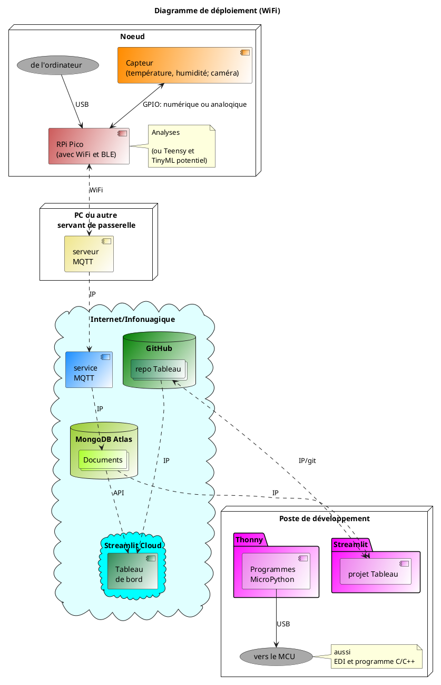
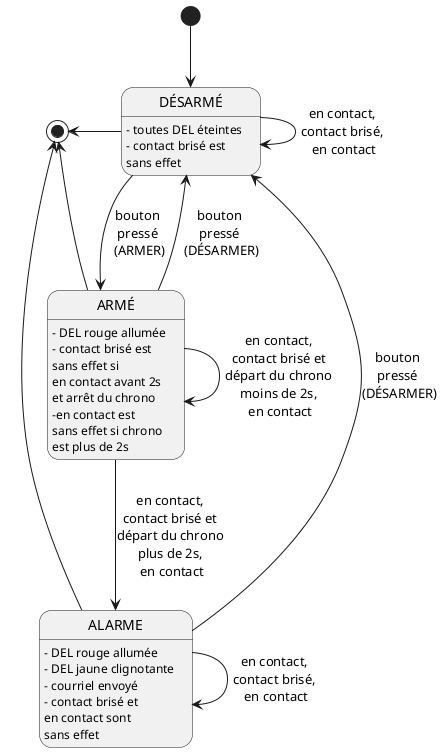

# LaTeX; dessins vectoriels

Un complément aux dépôts : **documentations_web_statiques** et **latex_pocket_book**.

## Éditeurs LaTeX

Pour les images, le PDF est le format idéal du LaTeX. Les formats PNG, JPG et JPEG passent aussi. Par contre, le SVG doit être converti en PDF.

Il est possible de dessiner en LaTeX grâce au module TikZ/PGF :

- Documentation en ligne et en PDF téléchargeable, galeries d'exemples.
- Beaucoup de références, de démos, de contenu pour apprendre.
- Dans un éditeur LaTeX en local ou en ligne.
- Nombreuses extensions spécialisées en diagrammes et schémas pour les mathématiques, la physique, l'informatique, la chimie, l'électricité, les réseaux, etc.

C'est un langage de programmation qui se matérialise en dessins PDF. On peut exporter le dessin en d'autres formats. L'IA générative accélère la programmation et évite le tâtonnement pour arriver au résultat désiré.

Contenu du fichier TEX pour créer un diagramme :

```latex
\documentclass{article}
\usepackage{tikz}
\usetikzlibrary{positioning}

\begin{document}

\begin{tikzpicture}[
roundnode/.style={circle, draw=green!60, fill=green!5, very thick, minimum size=7mm},
squarednode/.style={rectangle, draw=red!60, fill=red!5, very thick, minimum size=5mm},
]
%Nodes
\node[squarednode]      (maintopic)                              {2};
\node[roundnode]        (uppercircle)       [above=of maintopic] {1};
\node[squarednode]      (rightsquare)       [right=of maintopic] {3};
\node[roundnode]        (lowercircle)       [below=of maintopic] {4};

%Lines
\draw[->] (uppercircle.south) -- (maintopic.north);
\draw[->] (maintopic.east) -- (rightsquare.west);
\draw[->] (rightsquare.south) .. controls +(down:7mm) and +(right:7mm) .. (lowercircle.east);
\end{tikzpicture}

\end{document}
```

Le résultat PDF converti en PNG :


## Vectoriel vs matriciel 


Une photo ou une capture d'écran avec annotations sont des images matricielles (matrix, raster) à base de pixels. Les principaux formats sont : PNG, JPG, JPEG et GIF. Ces formats sont utilisés avec le Markdown, le HTML, les traitements de textes et le LaTeX.

| Photo  | Dessin conceptuel  |
|---|---|
|  |  |

Les images vectorielles (vector) comme les formats PDF et SVG sont plutôt faites de points, de segments, de polygones et de formes qui peuvent s'exprimer avec des vecteurs mathématiques. Le SVG passe avec le Markdown, le HTML et les traitements de textes. Le PDF est idéal pour le LaTeX. Le grand avantage du vectoriel est la capacité de changer l'échelle sans perdre en qualité :
 
 

## Dessins

Peu importe le format de la documentation, les dessins ajoutent beaucoup de valeur :

- diagrammes et schémas en tous genres,
- illustrations pour un domaine (géométrie, chimie, biologie, etc.).

Les diagrammes, les schémas et les illustrations peuvent être faites en matriciel ou en vectoriel. Ce dessin peut être matriciel ou vectoriel :


## Logiciels de dessins

Il existe deux approches :

- Avec un langage.
- Avec un GUI.

### Langage : PlantUML

PlantUML est un langage pour concevoir des **dessins spécialisés**. Quelques exemples suivent.

Il faut programmer avec un logiciel en ligne comme https://www.planttext.com/ ou installer un logiciel en local. L'IA générative accélère la programmation et évite le tâtonnement pour arriver au résultat désiré. Le code source se sauvegarde dans un fichier ou s'ajoute à un contenu comme avec ce README.md. Le dessin s'exporte en PDF; le format idéal pour le LaTeX. Le dessin s'exporte aussi en SVG et PNG.

Code source d'un diagramme de déploiement :



Ce résultat en PNG se retrouve dans le dépôt : **chaine_pico_streamlit**.


On retrouve plus de ce genre d'illustrations faites avec PlantUML à la page d'accueil de https://toucan-fortune-streamlit-projet-integrateur-01-accueil-0fsbkp.streamlit.app/

Code source d'un diagramme d'état :



Ce résultat en PNG se retrouve dans le dépôt : **systeme_alarme_rpi**.


Schémas de base de données SQL. Résultats en PNG dans le dépôt : **bases_donnees_sql_nosql**.

| Schéma relationel | Schéma physique |
|---|---|
|  |  |

Modèle de données JSON pour une collection sur MongoDB.  Résultat en PNG pour le projet dans le dépôt : **chaine_pico_streamlit**.


### GUI : Fritzing

Fritzing est un logiciel avec GUI de **dessins spécialisés en schémas électriques**. Quelques exemples suivent.

Avec le logiciel, on agence des icônes et ajouter des formes géométriques (points, segments, formes). Comme tout bon logiciel de dessin, le projet peut contenir plusieurs couches ou calques. Le projet se sauvegarde dans un fichier. Le dessin s'exporte en PNG, JPG, JPEG, SVG et PDF (ce dernier format est idéal pour un document LaTeX). Le logiciel produit aussi de produire des formats de production : fabrication de circuits imprimés (PCB), liste des composants et le format Eagle pour ce logiciel plus avancé que Fritzing.

Schémas en JPG dans le dépôt : **systeme_alarme_rpi** :

| Schéma de montage | Schéma de circuit électrique |
|---|---|
|  |  |

## Logiciels de dessins (suite)

### Langages

Ces langages produisent principalement des **dessins spécialisés**. L'IA générative accélère la programmation et évite le tâtonnement pour arriver au résultat désiré.

- PlantUML
    - Documentation en ligne et en PDF téléchargeables, galeries d'exemples.
    - Beaucoup de références, de démos, de contenu pour apprendre.
    - Logiciel open source en local ou en ligne.
        - https://www.plantuml.com/
        - https://plantuml.online/
        - https://www.planttext.com/
- Graphviz et le langage DOT
    - Documentation en ligne et en PDF téléchargeables, galeries d'exemples.
    - Beaucoup de références, de démos, de contenu pour apprendre.
    - Logiciel en local et en ligne.
- Mermaid
    - Documentation en ligne et en PDF téléchargeables, galeries d'exemples.
    - Beaucoup de références, de démos, de contenu pour apprendre.
    - Logiciel en local et en ligne.

Et bien d'autres.

## GUI

Certains logiciels ne sont pas spécialisés comme Fritzing et permettent de faire toutes sortes de dessins. Certains logiciels intègrent l'IA générative pour "dicter" un dessin. C'est une option pour démarrer plus rapidement ou pour peaufiner un dessin.

- Fritzing
    - Documentation en ligne et en PDF téléchargeables, galeries d'exemples.
    - Beaucoup de références, de démos, de contenu pour apprendre.
    - Logiciel open source en local.
- Dia
- draw.io
- Inkscape
- Vectr
- Adobe Illustrator
- Affinity Designer
- CorelDRAW
- Microsoft Visio
- Lucidchart
- Miro
- AutoCAD / FreeCAD
- bioRender

Et bien d'autres.
